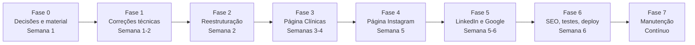

# Plano de Implantação — Portfólios Segmentados por Público

> **Projeto:** `portfolio` (GitHub Pages — `https://chichat1.github.io/portfolio/`)
> **Responsável:** MV Samuel Araújo
> **Data do plano:** 10/10/2026
> **Objetivo:** Transformar o portfólio único atual em um **ecossistema de páginas**, cada uma ajustada a um público, compartilhando a mesma base de código, os mesmos estilos e os mesmos arquivos.

---

## Sumário

1. [Visão geral e decisões de arquitetura](#1-visão-geral-e-decisões-de-arquitetura)
2. [Diagnóstico do estado atual](#2-diagnóstico-do-estado-atual)
3. [Fase 0 — Preparação e decisões pendentes](#3-fase-0--preparação-e-decisões-pendentes)
4. [Fase 1 — Correções técnicas (base sólida)](#4-fase-1--correções-técnicas-base-sólida)
5. [Fase 2 — Reestruturação do repositório](#5-fase-2--reestruturação-do-repositório)
6. [Fase 3 — Portfólio para Donos de Clínica (página principal)](#6-fase-3--portfólio-para-donos-de-clínica-página-principal)
7. [Fase 4 — Página para o Instagram](#7-fase-4--página-para-o-instagram)
8. [Fase 5 — LinkedIn e Google Perfil da Empresa: precisa de portfólio próprio?](#8-fase-5--linkedin-e-google-perfil-da-empresa-precisa-de-portfólio-próprio)
9. [Fase 6 — SEO, métricas, testes e publicação](#9-fase-6--seo-métricas-testes-e-publicação)
10. [Fase 7 — Manutenção contínua](#10-fase-7--manutenção-contínua)
11. [Cuidados éticos e legais (CFMV / LGPD)](#11-cuidados-éticos-e-legais-cfmv--lgpd)
12. [Cronograma sugerido e checklist geral](#12-cronograma-sugerido-e-checklist-geral)

---

## 1. Visão geral e decisões de arquitetura

### 1.1 Mapa dos públicos

| Canal | Público principal | O que essa pessoa quer saber | Ação desejada (conversão) | Formato recomendado |
|---|---|---|---|---|
| **Site principal** (link já publicado) | Donos e gestores de clínicas veterinárias | "Posso confiar meus pacientes a ele? Ele se integra bem à minha equipe?" | Chamar no WhatsApp para agendar procedimento | Portfólio completo (`/`) |
| **Instagram** | Tutores + colegas veterinários + seguidores | "Quem é ele, o que ele faz, onde vejo mais?" | Seguir, consumir conteúdo, chamar no WhatsApp | Página "link na bio" (`/links/`) |
| **LinkedIn** | Recrutadores, gestores, academia, colegas | "Qual a formação e a trajetória dele?" | Conectar, baixar CV | **Não precisa de site próprio** → aponta para o site principal (ver §8) |
| **Google Perfil da Empresa** | Pessoas buscando "anestesista veterinário perto de mim" | "Onde ele atende? Tem avaliações?" | Ligar / WhatsApp / visitar site | **Não precisa de site próprio** → aponta para o site principal (ver §8) |

### 1.2 Decisão de arquitetura: um repositório, várias páginas

**Recomendação:** manter **um único repositório** e criar subpastas para cada versão. O GitHub Pages publica cada pasta como uma URL própria.

```
https://chichat1.github.io/portfolio/          → Clínicas (principal, mantém o link atual e o QR Code do cartão funcionando)
https://chichat1.github.io/portfolio/links/    → Instagram (link na bio)
```

**Por que não repositórios separados?**
- CSS, JS, fontes, imagens e CV são compartilhados → uma correção vale para todas as páginas.
- Uma única configuração de Analytics, domínio e deploy.
- O link já divulgado continua funcionando (a página principal vira a versão "clínicas").

> [!NOTE]
> Se no futuro você comprar um domínio próprio (ex.: `samuelaraujo.vet.br`), a estrutura continua a mesma: `samuelaraujo.vet.br/` e `samuelaraujo.vet.br/links/`.

---

## 2. Diagnóstico do estado atual

Antes de mudar o conteúdo, há problemas no código atual que precisam ser corrigidos (alguns afetam o que o visitante vê hoje):

### 2.1 Bugs que quebram funcionalidades

| # | Problema | Onde | Impacto |
|---|---|---|---|
| B1 | Link do **"Baixar CV"** aponta para `assets/images/docs/...`, mas o arquivo está em `assets/docs/` | `index.html` L149 | Botão abre erro 404 |
| B2 | Link do **TCC** aponta para `assets/images/raw/TCC_SAMUEL.pdf`, mas o arquivo está em `assets/docs/` | `index.html` L492 | Projeto não abre |
| B3 | **Favicon** aponta para `assets/images/project/icon2.png` (pasta inexistente) | `index.html` L36 | Aba do navegador sem ícone |
| B4 | **OG Image** aponta para `chichat1.github.io/assets/...` (falta `/portfolio/`) e o arquivo `og-image.jpg` não existe | `index.html` L31 | Link compartilhado no WhatsApp/LinkedIn sem imagem de prévia |
| B5 | `sitemap.xml` e `robots.txt` ainda usam o domínio de exemplo `seu-dominio-ou-github-pages.com` | raiz | Google não indexa corretamente |
| B6 | O nome do arquivo do CV tem acento (`ARAÚJO`) | `assets/docs/` | Pode falhar em alguns servidores/navegadores → renomear para `cv-samuel-araujo.pdf` |

### 2.2 Problemas de qualidade/código

| # | Problema | Onde | Correção proposta |
|---|---|---|---|
| Q1 | O modo escuro troca imagens usando o atributo **`alt`** como "imagem alternativa" → todo `alt` é um caminho de arquivo | `assets/js/custom.js` L11–17 | Usar `data-src-dark="..."` e deixar o `alt` com texto descritivo (acessibilidade + SEO) |
| Q2 | O "smooth scroll" é aplicado também a links externos (`.custom-btn-link` → WhatsApp, LinkedIn, CV). Só funciona "por acidente" porque o jQuery lança erro antes do `preventDefault()` | `assets/js/custom.js` L34–41 | Aplicar apenas a links internos: `a[href^="#"]` |
| Q3 | Duas `<meta name="description">` diferentes | `index.html` L18 e L22 | Manter só uma, específica para cada página |
| Q4 | Muitos estilos inline (`style="font-weight: bold; color: #000..."`) | todo o `index.html` | Migrar para classes no `style.css` (necessário para reaproveitar entre páginas) |
| Q5 | Mapa aponta para um endereço em **Araguaína-TO**, enquanto a experiência atual é em **Balsas-MA** | `index.html` L513 | Substituir por "Região de atendimento" (ver §6) |
| Q6 | Rodapé e `<h3>` de contato vazios | `index.html` L519, L588–589 | Preencher (CRMV, ano, links) |
| Q7 | Pasta `assets/images/optimized/` vazia; imagens PNG sem compressão (~1,4 MB) | `assets/images/` | Converter para WebP (meta: < 300 KB no total da primeira dobra) |
| Q8 | jQuery 3.3.1 (2018) possui vulnerabilidades conhecidas | `assets/js/` | Atualizar para 3.7.x (baixo risco, mesma API) |
| Q9 | "PIBIC" está listado em "Certificações" | seção Experiência | Mover para "Pesquisa e produção científica" |
| Q10 | Há uma alteração não commitada no `index.html` (título mudou para "MV Esp Samuel Araújo") | git | Decidir o título final (ver pergunta sobre o "Esp" em §3) e commitar |

---

## 3. Fase 0 — Preparação e decisões pendentes

### 3.1 Perguntas que precisam de resposta antes de escrever os textos

- [ ] **CRMV:** número e UF(s). Você atua no MA e no TO? (Atuar em outro estado exige inscrição secundária e o número deve aparecer no site.)
- [ ] **Título "Esp":** a especialização já foi concluída? Em qual área/instituição? *(Só usar "Esp." com certificado em mãos — ver §11.)*
- [ ] **Modelo de trabalho com clínicas:** anestesista volante/por procedimento? Vínculo fixo? Leva equipamentos (monitor multiparamétrico, aparelho de anestesia inalatória) e/ou fármacos?
- [ ] **Região de atendimento:** quais cidades? Atende urgências/plantões?
- [ ] **Espécies:** cães e gatos apenas, ou também silvestres/exóticos? (A sua experiência com silvestres é um diferencial forte.)
- [ ] **Técnicas que domina e quer divulgar:** anestesia inalatória, TIVA/infusão contínua, bloqueios locorregionais, epidural, etc.
- [ ] **Ciência de Dados:** some do site de clínicas, vira um diferencial discreto ("gestão com dados") ou ganha uma página própria? *(Recomendação em §6.4.)*
- [ ] **Público do Instagram:** tutores, colegas veterinários ou os dois? *(Recomendação em §7.)*
- [ ] **Depoimentos:** há cirurgiões/donos de clínica que topariam dar um depoimento curto por escrito?
- [ ] **Domínio próprio:** vale comprar agora (ex.: `.vet.br` ou `.com.br`)?

### 3.2 Material a produzir/reunir

- [ ] **Foto profissional** (jaleco/pijama cirúrgico, fundo neutro) — hoje o site não tem foto sua, e para clínicas e Instagram o rosto gera confiança.
- [ ] 2–4 fotos **de bastidores** (monitorando um paciente, preparando o protocolo) — com autorização da clínica e do tutor.
- [ ] Logo/assinatura visual (já existe `headerlight.png`/`headerdark.png` — validar se continua).
- [ ] **OG Image** 1200×630 px para cada página (clínicas e Instagram).
- [ ] CV atualizado em PDF (versão 2026).
- [ ] Opcional: **apresentação em PDF de 1 página** para clínicas ("media kit" profissional) — ótima para enviar por WhatsApp.

---

## 4. Fase 1 — Correções técnicas (base sólida)

Fazer **antes** de qualquer mudança de conteúdo, em um commit separado (`fix: correções de caminhos, SEO e acessibilidade`).

- [x] Corrigir B1–B6 (caminhos de CV, TCC, favicon, OG image, sitemap/robots, nome do PDF).
- [x] Remover a `meta description` duplicada (Q3).
- [x] Refatorar o modo escuro para `data-src-dark` (Q1):
  ```html
  
  ```
  ```js
  $('img[data-src-dark]').each(function () {
    var img = $(this), atual = img.attr('src');
    img.attr('src', img.attr('data-src-dark')).attr('data-src-dark', atual);
  });
  ```
- [x] Restringir o smooth scroll a `a[href^="#"]` (Q2).
- [x] Salvar a preferência de tema no `localStorage` (hoje volta ao claro a cada visita).
- [x] Converter imagens para WebP em `assets/images/optimized/` e adicionar `loading="lazy"` nas imagens abaixo da primeira dobra (Q7).
- [x] Atualizar jQuery (Q8) e testar carrossel/headroom.
- [x] Commitar ou descartar a alteração pendente do título (Q10).

---

## 5. Fase 2 — Reestruturação do repositório

### 5.1 Estrutura proposta

```
portfolio/
├── index.html                  → Portfólio CLÍNICAS (principal)
├── links/
│   └── index.html              → Página INSTAGRAM (link na bio)
├── 404.html
├── robots.txt
├── sitemap.xml                 → lista "/" e "/links/"
├── PLANO_DE_IMPLANTACAO.md
├── README.md
└── assets/
    ├── css/
    │   ├── style.css           → estilos compartilhados (cores, fontes, botões, modo escuro)
    │   └── links.css           → estilos exclusivos da página do Instagram
    ├── js/
    │   ├── custom.js           → tema, scroll, carrossel (compartilhado)
    │   └── analytics-events.js → eventos de clique (WhatsApp, CV, formulário)
    ├── images/
    │   ├── optimized/          → WebP usados no site
    │   ├── og/                 → og-clinicas.jpg, og-links.jpg
    │   └── raw/                → originais (não referenciados no HTML)
    └── docs/
        ├── cv-samuel-araujo.pdf
        ├── apresentacao-clinicas.pdf   (opcional)
        └── tcc-samuel-araujo.pdf
```

> [!IMPORTANT]
> Na pasta `links/`, todos os caminhos devem subir um nível (`../assets/...`). Alternativa mais robusta: usar `<base href="/portfolio/">` — mas isso exige ajustar caso um domínio próprio seja adotado.

### 5.2 Design system mínimo (para manter coerência entre páginas)

- [x] Definir variáveis CSS no topo do `style.css`: `--cor-primaria`, `--cor-texto`, `--cor-fundo`, `--fonte-titulo`, `--fonte-texto`, e suas versões no modo escuro.
- [x] Componentes reutilizáveis: `.btn-whatsapp`, `.brand-logo`, `.service-card-wrapper`, `.timeline-heading`, `.timeline-list`, etc.
- [x] Mesma foto, logo e paleta em todas as páginas e nos perfis (Instagram, LinkedIn, Google) — reconhecimento de marca.

---

## 6. Fase 3 — Portfólio para Donos de Clínica (página principal)

### 6.1 Mudança de posicionamento

| Hoje | Depois |
|---|---|
| Fala com o **tutor** ("Se você tem notado alterações no seu Pet...") | Fala com o **dono/gestor da clínica** ("Sua equipe cirúrgica com mais segurança e previsibilidade") |
| Serviços de clínica geral (consulta, vacina, domicílio, exames) | Foco em **anestesia multimodal balanceada** |
| "Médico Veterinário / Cientista de Dados" | "Anestesiologia Veterinária" + diferenciais humanos (**empatia** e **relacionamento interpessoal**) |
| Lista longa de experiências e certificados de TI | Trajetória enxuta e relevante para centro cirúrgico |

### 6.2 Nova estrutura de seções (ordem sugerida)

#### 1) Hero (primeira dobra)
- **Título:** "Anestesia veterinária segura e humanizada para a sua clínica"
- **Subtítulo:** "MV Samuel Araújo · CRMV-XX nº 0000 · Anestesia multimodal balanceada para cães, gatos *(e silvestres?)* em *[cidades]*."
- **Texto animado** (substituir "Cientista de dados"): "Anestesia multimodal" · "Controle da dor" · "Segurança do paciente".
- **CTAs:** `Agendar procedimento (WhatsApp)` com mensagem pré-preenchida para clínicas + `Baixar apresentação/CV`.
- **Foto profissional** no lugar da ilustração atual.

#### 2) Serviços — Anestesia multimodal balanceada
Card principal explicando **o conceito na linguagem do benefício para a clínica**:
> Combinação de fármacos e técnicas com mecanismos diferentes (sedação, analgesia, relaxamento e hipnose) em doses menores de cada um → maior estabilidade cardiovascular, analgesia mais completa, recuperação mais rápida e tranquila e menor risco de intercorrências.

**O que isso significa para o dono da clínica:**
- Menos intercorrências → menos estresse da equipe e mais confiança do tutor.
- Recuperação mais rápida → melhor giro de agenda e internação.
- Paciente sem dor → tutor satisfeito → retorno e indicação.

Cards secundários (**confirmar quais você realiza** — ver §3.1):
- [ ] Avaliação pré-anestésica e classificação de risco (ASA)
- [ ] Monitoração transanestésica com ficha anestésica registrada
- [ ] Analgesia pós-operatória e orientações de alta
- [ ] Anestesia locorregional (bloqueios, epidural)
- [ ] Pacientes de alto risco (idosos, cardiopatas, braquicefálicos)
- [ ] Anestesia em animais silvestres/exóticos

#### 3) Diferenciais — Empatia e Relacionamentos Interpessoais
Seção nova, que transforma soft skills em **benefícios concretos** (evitar só listar adjetivos):

| Diferencial | Como aparece na prática |
|---|---|
| **Empatia com o tutor** | Explico o protocolo e os riscos em linguagem simples, acolho o medo da anestesia e ajudo a clínica no termo de consentimento — o tutor sai mais seguro e confiando na clínica. |
| **Empatia com o paciente** | Manejo de baixo estresse, pré-medicação adequada e recuperação acompanhada. |
| **Relacionamento com a equipe** | Comunicação clara com o cirurgião antes, durante e depois do procedimento; respeito aos protocolos e à rotina da casa. |
| **Relacionamento com a gestão** | Pontualidade, previsibilidade de agenda, postura profissional e registro de tudo o que foi feito. |
| **Gestão com dados** *(ponte com Ciência de Dados)* | Fichas anestésicas organizadas e, se a clínica quiser, relatórios simples de indicadores (procedimentos, intercorrências, tempo de recuperação). |

> [!TIP]
> Reforce os diferenciais com evidências: a monitoria em Fisiologia I e II (base fisiológica da anestesia), a função de secretário no GEASTO (trabalho em equipe e organização) e a experiência com silvestres (manejo de pacientes difíceis).

#### 4) Como funciona a parceria (fluxo em 4–5 passos)
`Contato e agendamento` → `Avaliação pré-anestésica` → `Procedimento com monitoração` → `Recuperação e alta` → `Ficha/relatório entregue à clínica`

#### 5) Trajetória (versão enxuta da seção atual)
- Manter: UFNT, Clínica Animalia, estágio na UFPA (HVSAS), Zoobotânica de Marabá, OLVET.
- Destacar em cada experiência os itens ligados a **cirurgia/anestesia/equipe**.
- Remover: ensino médio (pouco relevante para clínicas).
- Mover os certificados Google (BI, Análise de Dados, Gerenciamento de Projetos) para uma linha discreta: "Outras competências: gestão de projetos e análise de dados".
- Atualizar datas (o site ainda mostra 2024 como mais recente).

#### 6) Pesquisa e produção científica
- TCC e PIBIC (neoplasias em animais de companhia) — mostrar como "base científica", com link corrigido para o PDF.

#### 7) Depoimentos (prova social)
- 2–3 depoimentos curtos de cirurgiões ou donos de clínica, com nome, clínica e cidade (com autorização por escrito).
- Enquanto não houver depoimentos, ocultar a seção (não usar textos fictícios).

#### 8) Perguntas frequentes (para clínicas)
- Você leva equipamentos e fármacos?
- Com quanta antecedência preciso agendar?
- Atende urgências?
- Quais cidades você atende?
- A clínica recebe a ficha anestésica?

#### 9) Contato
- Botão grande de WhatsApp com mensagem pré-preenchida: *"Olá, Samuel! Sou da clínica ___ e gostaria de agendar um procedimento."*
- Formulário com campos específicos: **Nome**, **Clínica**, **Cidade**, **WhatsApp**, **Tipo de procedimento**, **Mensagem** + campo oculto `origem=site-clinicas`.
- Substituir o mapa por **"Região de atendimento"** (lista de cidades ou mapa da região).

#### 10) Rodapé
- Nome · CRMV · e-mail · LinkedIn · Instagram · Lattes · © 2026 · link para aviso de privacidade.

### 6.3 O que sai da página de clínicas

| Seção atual | Destino |
|---|---|
| Consultas | Remover (ou mover para a página do Instagram, se você atender tutores diretamente) |
| Protocolos vacinais | Remover / virar conteúdo educativo no Instagram |
| Atendimento a domicílio | Remover (ou página do Instagram, se ainda oferecer) |
| Encaminhamento para exames | Remover (incorporado à "Avaliação pré-anestésica") |

### 6.4 E a Ciência de Dados?

Recomendação: **não apagar, reposicionar**. Para donos de clínica, "cientista de dados" no título confunde o posicionamento; como **diferencial de gestão** ("Gestão com dados"), agrega valor. Se você quiser buscar vagas na área de dados, crie no futuro uma página separada (`/dados/`) com projetos e dashboards — ela seria a ideal para colocar no LinkedIn (ver §8).

### 6.5 SEO da página de clínicas
- `<title>`: `Samuel Araújo | Anestesia Veterinária Multimodal para Clínicas – [Cidade/UF]`
- `meta description`: `Anestesista veterinário em [cidades]. Anestesia multimodal balanceada, monitoração e controle da dor com segurança para o paciente e tranquilidade para a sua clínica.`
- OG: título, descrição e `og-clinicas.jpg` (1200×630) com URL absoluta correta.
- JSON-LD `schema.org` (`Person` + `ProfessionalService`/`VeterinaryCare`) com nome, CRMV, área de atendimento e contatos.

---

## 7. Fase 4 — Página para o Instagram

### 7.1 Conceito recomendado: "link na bio" próprio (`/links/`)

O Instagram permite poucos links e o visitante chega pelo **celular, com pouca paciência**. Em vez de mandá-lo para o portfólio completo (feito para clínicas), crie uma página **leve, vertical e rápida**, que funciona como um *Linktree* próprio — mas com a sua identidade visual, sem anúncios de terceiros e com métricas no seu Analytics.

**Estrutura sugerida (rolagem única, mobile-first):**

1. **Cabeçalho:** foto redonda, nome, "Médico Veterinário · Anestesiologia", CRMV, cidade, frase curta de propósito
   *ex.: "Anestesia com ciência e empatia: segurança para o seu pet, tranquilidade para você."*
2. **Botões principais (bifurcação por público):**
   - 🐾 **"Sou tutor"** → WhatsApp com mensagem para tutores / FAQ "Meu pet vai ser anestesiado"
   - 🏥 **"Sou clínica ou colega"** → portfólio principal (`/`)
3. **Conteúdo em destaque:** 3–6 miniaturas dos posts/Reels mais importantes (links diretos para o Instagram).
4. **Material gratuito (isca digital):** PDF para baixar, ex.:
   - "Checklist: como preparar seu pet para a anestesia (jejum, medicações, o que levar)"
   - "Guia: sinais de dor em cães e gatos"
5. **"Pergunte ao anestesista":** link para formulário/caixa de perguntas que vira pauta de conteúdo.
6. **Outros canais:** LinkedIn, Lattes, e-mail, Google Perfil da Empresa (avaliações).
7. **Rodapé** com CRMV e aviso de privacidade.

### 7.2 Outras ideias para a página do Instagram (para escolher/combinar)

| Ideia | Descrição | Esforço | Quando faz sentido |
|---|---|---|---|
| **A. Link na bio** *(recomendado para começar)* | Página descrita acima | Baixo | Desde já |
| **B. Biblioteca de conteúdos** | Página `/conteudos/` organizando posts por tema (Pré-anestesia, Dor, Silvestres, Para colegas), com resumo em texto de cada um | Médio | Quando houver 15+ posts — também ajuda no Google |
| **C. "Mitos e verdades da anestesia"** | Página interativa (cards que viram) respondendo medos comuns dos tutores | Médio | Ótima para compartilhar nos Stories |
| **D. Página de evento/curso** | Inscrição para live, minicurso para estudantes ou palestra | Médio | Se quiser se posicionar como educador |
| **E. "Dado da semana"** | Infográficos com dados veterinários (ex.: os resultados do seu PIBIC sobre neoplasias) — une veterinária e ciência de dados | Médio | Diferencial único no nicho |
| **F. Mini "media kit"** | Página para marcas/empresas (números do perfil, público, parcerias) | Baixo | Quando o perfil crescer e houver interesse comercial |

### 7.3 Pilares de conteúdo sugeridos para o perfil

| Pilar | Público | Exemplos de pauta |
|---|---|---|
| **Anestesia sem medo** | Tutores | "Meu pet idoso pode ser anestesiado?", "Por que o jejum é importante?", "O que é anestesia multimodal?" |
| **Bastidores** | Todos | Rotina de monitoração, preparo do centro cirúrgico, "um dia comigo" |
| **Dor tem tratamento** | Tutores | Sinais de dor em cães e gatos, analgesia pós-operatória |
| **Para colegas** | Veterinários/estudantes | "Protocolo em 60 segundos", fisiologia aplicada à anestesia, bloqueios locorregionais |
| **Silvestres** | Todos | Curiosidades e desafios do manejo/anestesia de silvestres |
| **Ciência e dados** | Colegas/curiosos | Infográficos de artigos, resultados de pesquisa explicados |
| **Humano por trás do jaleco** | Todos | Trajetória, valores, empatia, trabalho em equipe |

**Sugestão de bio do Instagram:**
```
Médico Veterinário | Anestesiologia 💉
Anestesia multimodal: segurança e conforto para o seu pet
📍 [Cidade-UF] · CRMV-XX 0000
👇 Agende, conteúdos e materiais gratuitos
```

---

## 8. Fase 5 — LinkedIn e Google Perfil da Empresa: precisa de portfólio próprio?

### 8.1 Resposta curta

| Canal | Precisa de um portfólio/site separado? | O que fazer |
|---|---|---|
| **LinkedIn** | **Não** (por enquanto) | Otimizar o próprio perfil e apontar para o site principal. Só criar `/dados/` se for buscar vagas em ciência de dados. |
| **Google Perfil da Empresa** | **Não** | Criar o perfil (se fizer sentido para o seu modelo de trabalho) e apontar o campo "Site" para o site principal. |

O LinkedIn e o Google **já são, eles mesmos, a "vitrine"** nesses canais. Criar mais um site duplicaria manutenção sem ganho real. O que muda é **o link de entrada** (com UTM, para medir de onde vem cada visita — ver §9.2).

### 8.2 LinkedIn — checklist de otimização
- [ ] Foto e capa iguais à identidade do site (capa com o slogan e o link).
- [ ] **Título:** `Médico Veterinário | Anestesiologia Veterinária | Anestesia Multimodal Balanceada | Análise de Dados`
- [ ] **Sobre:** versão em texto corrido do hero + diferenciais (empatia, relacionamento, dados).
- [ ] **Destaques (Featured):** link do portfólio, CV em PDF, TCC.
- [ ] Experiências atualizadas, coerentes com o site.
- [ ] Competências: Anestesiologia Veterinária, Analgesia, Monitoração Anestésica, Comunicação, Trabalho em equipe, Python, SQL.
- [ ] Publicar versões "profissionais" dos conteúdos do Instagram (mais técnicas, foco em gestores e colegas).

### 8.3 Google Perfil da Empresa — quando vale a pena
**Vale a pena se:** você atende como profissional autônomo/volante e quer ser encontrado por clínicas e tutores da região, e/ou quer acumular **avaliações** (prova social muito forte).

**Pontos de atenção:**
- Para quem não recebe clientes em endereço fixo, configure como **"empresa de área de serviço"** (oculta o endereço e mostra as cidades atendidas).
- O Google exige verificação (geralmente por vídeo) e pode pedir comprovação da atividade.
- Categoria sugerida: "Veterinário" / "Serviço veterinário".
- Site: `.../portfolio/?utm_source=google&utm_medium=perfil_empresa`
- Peça avaliações às clínicas parceiras e tutores após os procedimentos.

> [!NOTE]
> Se o Perfil da Empresa for criado, `sitemap.xml`, `robots.txt` e o JSON-LD deixam de ser "exagero" (como diz o `README.md` atual) e passam a ser úteis: eles ajudam o Google a relacionar o site ao seu perfil local.

---

## 9. Fase 6 — SEO, métricas, testes e publicação

### 9.1 SEO técnico
- [ ] `sitemap.xml` com `/` e `/links/` e a `lastmod` atualizada.
- [ ] `robots.txt` apontando para o sitemap real.
- [ ] `<link rel="canonical">` em cada página.
- [ ] Cadastrar o site no **Google Search Console** e enviar o sitemap.
- [ ] Testar a prévia dos links: [opengraph.xyz](https://www.opengraph.xyz/), WhatsApp e LinkedIn Post Inspector.

### 9.2 Links rastreáveis (UTM) por canal

| Origem | Link a usar |
|---|---|
| Bio do Instagram | `/links/?utm_source=instagram&utm_medium=bio` |
| LinkedIn (Destaques/Contato) | `/?utm_source=linkedin&utm_medium=perfil` |
| Google Perfil da Empresa | `/?utm_source=google&utm_medium=perfil_empresa` |
| QR Code do cartão de visita | `/?utm_source=qrcode&utm_medium=cartao` |
| Envio direto por WhatsApp para clínicas | `/?utm_source=whatsapp&utm_medium=prospeccao` |

### 9.3 Eventos no Google Analytics (GA4 — tag `G-RKEN3DRMSZ` já instalada)
- [ ] `clique_whatsapp` (com parâmetro `pagina` = clinicas/links)
- [ ] `download_cv` / `download_material`
- [ ] `envio_formulario`
- [ ] `clique_bifurcacao` (tutor × clínica, na página do Instagram)

### 9.4 Testes antes de publicar
- [ ] Celular (Android e iPhone), tablet e desktop — tema claro e escuro.
- [ ] Todos os links (WhatsApp, PDFs, redes) e o formulário (mensagem chega no e-mail?).
- [ ] Lighthouse (Chrome DevTools): meta ≥ 90 em Desempenho, Acessibilidade, Boas práticas e SEO.
- [ ] Página 404 funcionando também dentro de `/links/`.
- [ ] Revisão de texto (ortografia — ex.: "ambietais" → "ambientais", "à domicílio" → "a domicílio").

### 9.5 Fluxo de publicação (Git)
1. Criar branch `reformulacao-publicos`.
2. Commits por fase: `fix:` (Fase 1) → `refactor:` (Fase 2) → `feat: página clínicas` → `feat: página links`.
3. Testar localmente (ex.: extensão Live Server do VS Code ou `python -m http.server`).
4. Merge na `master` → GitHub Pages publica automaticamente.
5. Atualizar links no Instagram, LinkedIn, Google e gerar o novo QR Code (com UTM).

---

## 10. Fase 7 — Manutenção contínua

| Frequência | Tarefa |
|---|---|
| Mensal | Ver no Analytics de onde vêm as visitas e quantos cliques no WhatsApp; atualizar destaques da página do Instagram |
| Trimestral | Atualizar experiências, depoimentos e o CV; revisar a `lastmod` do sitemap |
| A cada novo material | Adicionar ao bloco de materiais gratuitos / biblioteca |
| Anual | Revisar preços/modelo de atendimento, fotos e identidade visual |

---

## 11. Cuidados éticos e legais (CFMV / LGPD)

> [!WARNING]
> Publicidade de serviços veterinários segue o **Código de Ética do Médico Veterinário (Resolução CFMV nº 1.138/2016)** e as normas do seu CRMV. Revise os textos finais com essas regras em mente.

- [ ] Exibir **nome completo e número do CRMV** em todas as páginas.
- [ ] Usar **"Especialista/Esp."** apenas com título concluído e reconhecido.
- [ ] Evitar promessas de resultado ("anestesia sem riscos", "100% seguro") → preferir "mais segurança", "riscos minimizados".
- [ ] Não expor pacientes de forma sensacionalista; fotos e casos **somente com autorização** do tutor e da clínica.
- [ ] Não prescrever nem "diagnosticar" pelas redes sociais (nos conteúdos para tutores, sempre orientar a procurar um veterinário).
- [ ] Confirmar com o CRMV as regras sobre **divulgação de preços** e de **depoimentos** antes de publicá-los.
- [ ] **LGPD:** o formulário coleta nome, e-mail e telefone → adicionar um aviso de privacidade curto (para que os dados são usados, que não são compartilhados, como pedir exclusão) e citar o uso do Google Analytics.

---

## 12. Cronograma sugerido e checklist geral

Estimativa considerando dedicação parcial (algumas horas por semana):



### Checklist resumido

- [ ] **Fase 0** — Responder as perguntas de §3.1 e reunir fotos, CRMV, CV e OG images
- [x] **Fase 1** — Corrigir bugs B1–B6 e Q1–Q10
- [x] **Fase 2** — Criar a estrutura de pastas, variáveis CSS e componentes compartilhados
- [ ] **Fase 3** — Reescrever o `index.html` para donos de clínica (anestesia multimodal balanceada, empatia, relacionamentos interpessoais)
- [ ] **Fase 4** — Criar `links/index.html` (link na bio) e definir os pilares de conteúdo
- [ ] **Fase 5** — Otimizar o LinkedIn; decidir e (se for o caso) criar o Google Perfil da Empresa
- [ ] **Fase 6** — SEO, UTMs, eventos GA4, testes e publicação
- [ ] **Fase 7** — Rotina de manutenção

---

*Próximo passo sugerido: responder às perguntas da [Fase 0](#3-fase-0--preparação-e-decisões-pendentes). Com essas respostas, os textos finais da página de clínicas e da página do Instagram podem ser escritos e implementados.*
